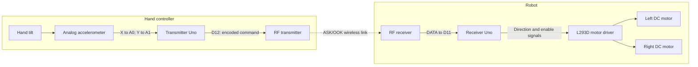
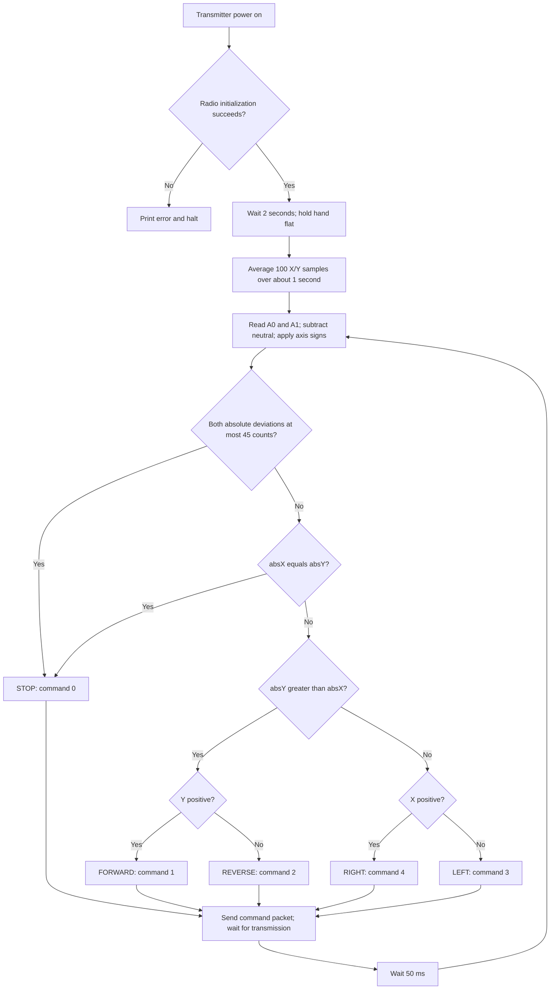
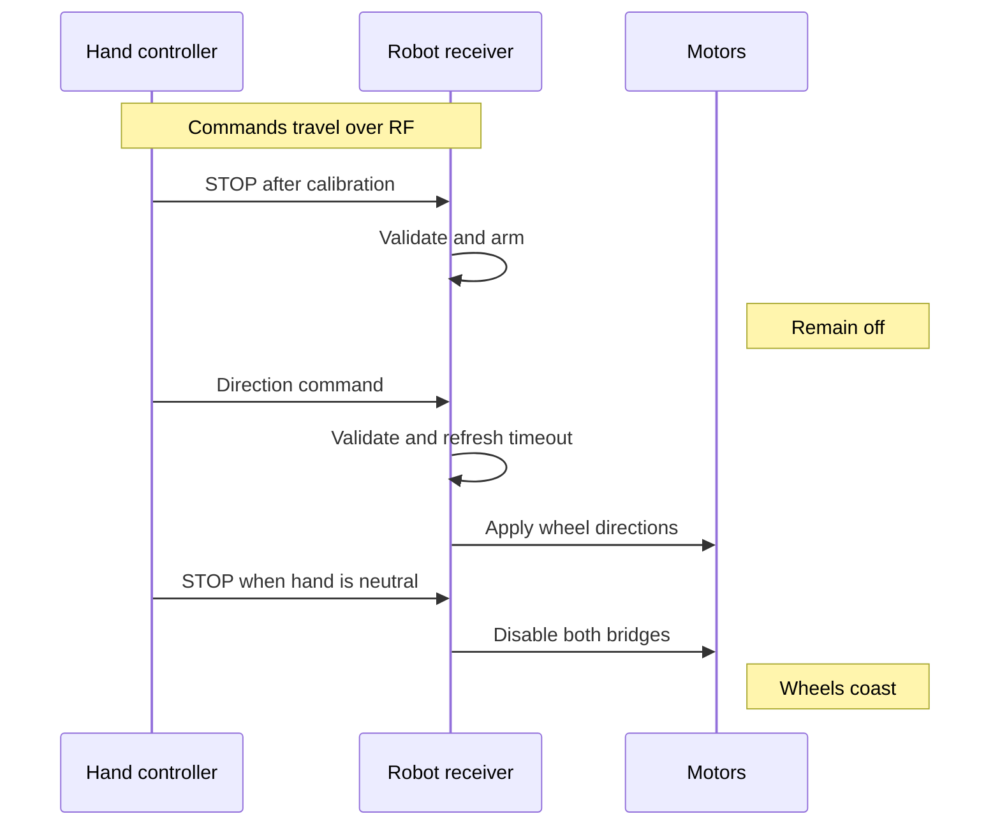
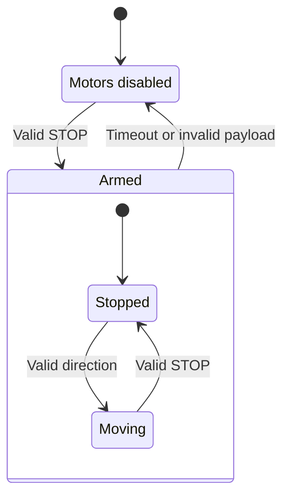
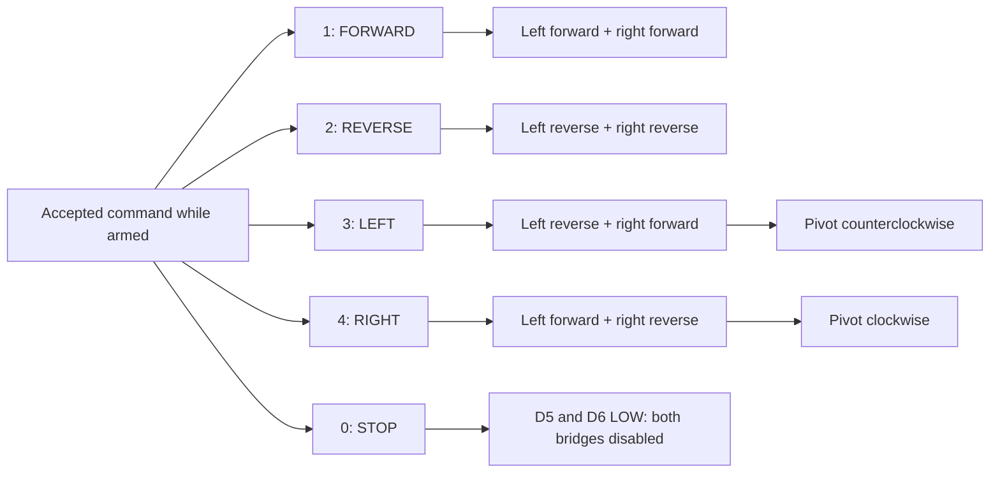
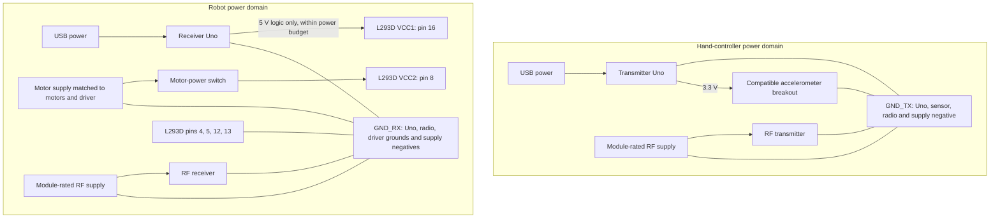

# Hand Gesture Controlled Robot

An engineering project: hand tilt → analog accelerometer → Arduino → RF link → Arduino → dual DC motors.

## System architecture

The hand controller and robot are separate devices. The wireless link carries direction commands; each device has its own power source.

## Gestures and operation

The controller reads hand tilt and sends a direction command over RF. The robot receives that command and drives its two motors through the L293D. Neutral stops the motors; the reconstructed firmware also stops and disarms after communication loss.

[Explore the control flow and operating snapshots](docs/system-overview.md). These are newly drawn illustrations of the reconstructed design; actual hardware testing remains pending.

## What is covered

The reference diagram shows an Arduino Uno, an L293D, two motors, and a battery labeled 9 V. The sensor and wireless link are not shown. The proposed reconstruction uses two Unos, an ADXL335-compatible analog sensor, and a matched ASK/OOK radio pair. Exact original sensor/radio variants, frequency, wiring, software, project year, and individual contributions remain unconfirmed.

## How the firmware works

These diagrams describe the reconstructed code in this repository. Gesture thresholds, arming, and timeout behavior are implementation choices that still require hardware validation.

### 1. Startup and gesture classification

Calibration runs once at transmitter startup. After that, every cycle selects one command. `absX` and `absY` are the absolute deviations from the calibrated neutral readings, after applying the configured axis signs.

The threshold is in raw ADC counts, not degrees. Total transmission-cycle time includes packet airtime and processing as well as the 50 ms delay.

### 2. Wireless command exchange

The application payload has three bytes: `G`, protocol version `1`, and command `0`–`4`. RadioHead adds framing and CRC. This diagram shows a successful arming and driving sequence; the link sends no acknowledgements.

### 3. Receiver states and recovery

An **armed** receiver may accept movement commands. A **disarmed** receiver requires a valid STOP packet first. Invalid application payloads disarm immediately; a radio CRC failure is dropped and does not refresh the timeout.

| Event | Receiver behavior |
| --- | --- |
| Movement packet while disarmed | Ignore it and keep motors disabled |
| Valid STOP while disarmed | Arm the receiver with motors off |
| Valid packet while armed | Apply the command and refresh the timeout |
| No accepted packet for 500 ms | Disable motors and disarm |
| Invalid application payload | Disable motors and disarm |
| Radio CRC failure | Drop the frame without refreshing the timeout |

Repeated commands retain the current stopped or moving state. After disarming, a valid STOP is required before movement can resume.

Timeouts are checked by the firmware loop. Disabling the bridges allows coasting; it does not guarantee the wheels physically stop within 500 ms. A receiver radio-initialization failure leaves the outputs disabled and halts the sketch.

### 4. Direction commands and wheel motion

Wheel directions are viewed from above with the robot front at the top. Verify motor polarity during the raised-wheel test. The driver disables both enables before a command change; a new movement command adds a 20 ms disabled interval before energizing the outputs.

### 5. Power and ground relationships

This is a power-distribution overview, not a physical pin-layout drawing. Use the circuit sheets below for connections, bypass capacitors, and enable pulldowns. Radio supplies and data-level compatibility depend on the actual modules.

GND_TX and GND_RX are not wired together. The motor supply does not connect to the Uno 5 V rail. A module-rated RF supply may share a compatible logic rail only after its requirements and the available current are confirmed.

## Circuit diagrams

These original connection diagrams match the reconstructed firmware. Pin positions are symbolic; the L293D labels include physical DIP pin numbers. Radio models and supply requirements still need confirmation.

### Hand-controller transmitter

### Robot receiver and motors

### Power and enable connections

[Download SVG diagrams and read the diagram guide](docs/diagrams.md). The supplied historical reference remains in the [evidence register](docs/evidence.md).

## Reference implementation

- Neutral calibration at transmitter startup; dominant-axis tilt selects forward, backward, left, or right.
- A neutral dead zone commands stop; diagonal ties also stop.
- Versioned command packets over RadioHead ASK at 2,000 bits/s.
- Receiver starts disabled and requires a stop packet before accepting movement after startup or link loss.
- A 500 ms command timeout disables motor outputs; invalid application packets stop and disarm the receiver.
- Enable pins are disabled before changing motor direction.

## Build and explore

1. Read [hardware and wiring](docs/hardware.md) before connecting power.
2. Follow [setup and calibration](docs/setup.md) to install dependencies and upload both sketches.
3. Run the host logic checks with `sh tests/run.sh` (requires a C++11 compiler).
4. Follow the [bench validation plan](docs/validation.md), keeping wheels off the ground initially.

| Path | Contents |
| --- | --- |
| `firmware/transmitter/` | Hand-controller sketch |
| `firmware/receiver/` | Robot sketch |
| `libraries/GestureControl/` | Shared classifier, packet parser, and timeout logic |
| `docs/` | Evidence, wiring, setup, validation, portfolio notes |
| `assets/reference/` | Supplied motor-control reference diagram |
| `assets/diagrams/` | Seven illustrated PNG/SVG diagram pairs |
| `tests/` | Host logic regression tests |

## References and attribution

- [Analog Devices ADXL335](https://www.analog.com/en/products/adxl335.html): candidate analog accelerometer specifications.
- [Texas Instruments L293D](https://www.ti.com/product/L293D): driver specifications and datasheet.
- [RadioHead RH_ASK](https://www.airspayce.com/mikem/arduino/RadioHead/classRH__ASK.html): reference firmware radio API.
