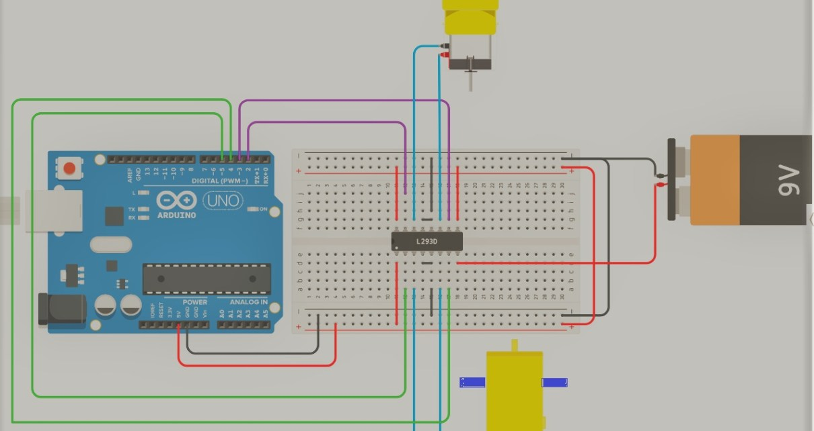

# Evidence register

## Supplied motor-control reference

The owner supplied this clearer diagram on 2026-09-29 to replace the five earlier photographs. The date records receipt, not the original project date. The original creator and license are unconfirmed.

| Visible evidence | Limitations |
| --- | --- |
| Arduino Uno, breadboard, L293D, two motors, and battery labeled 9 V | Reference illustration; does not establish the original as-built wiring or successful operation |
| Motor-driver wiring | Does not match all pin assignments and enable-control provisions in the reconstructed firmware; follow the documented pin map |
| Motor-control subsystem | No accelerometer or RF modules are depicted; their exact original variants remain unconfirmed |

The diagram's battery label does not establish the original battery or a suitable supply for unknown motors. Earlier reference material informed the initial reconstruction, but the proposed sensor, radio, and two-board architecture remain provisional.

## Owner-confirmed behavior

On 2026-09-29, the owner confirmed that hand tilts commanded forward, reverse, and turns. Exact gesture-to-axis mapping and neutral-stop behavior were not specified; those remain reconstruction choices.
