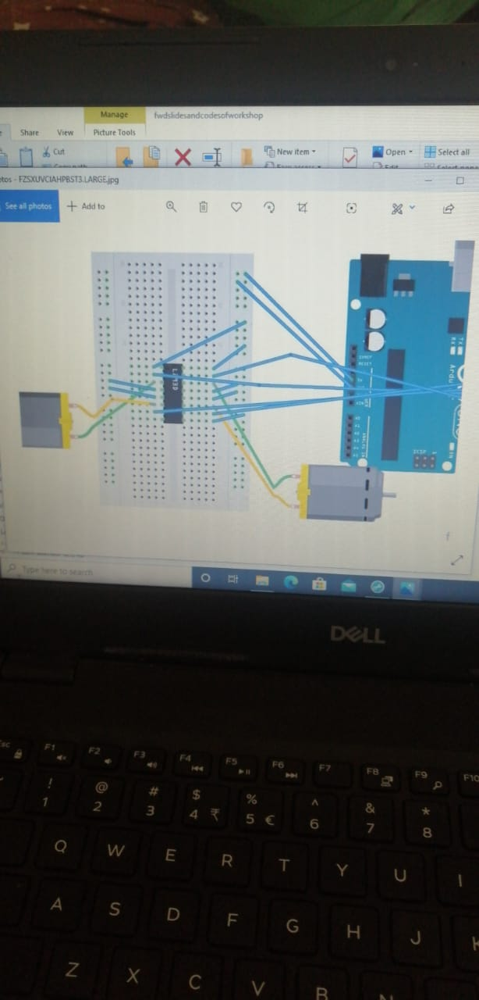
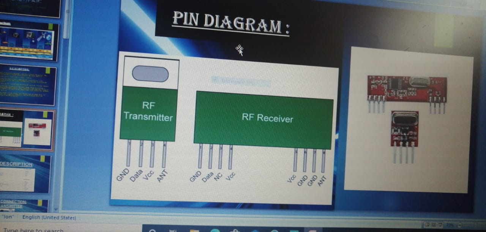
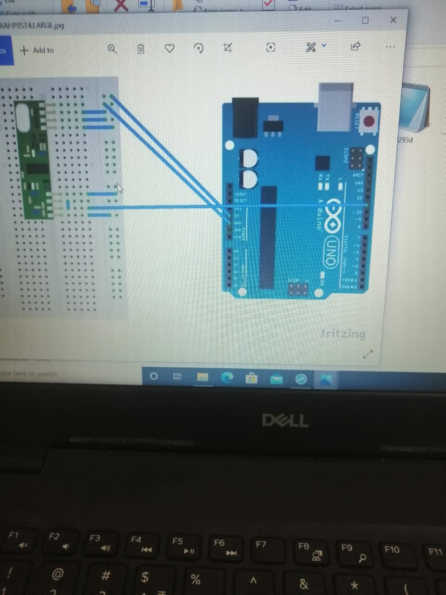
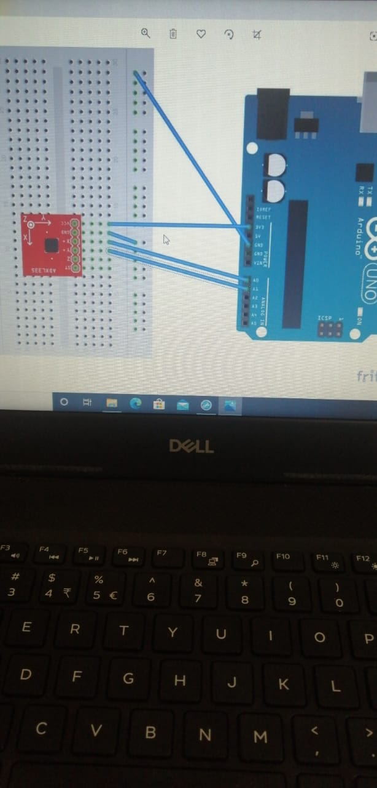
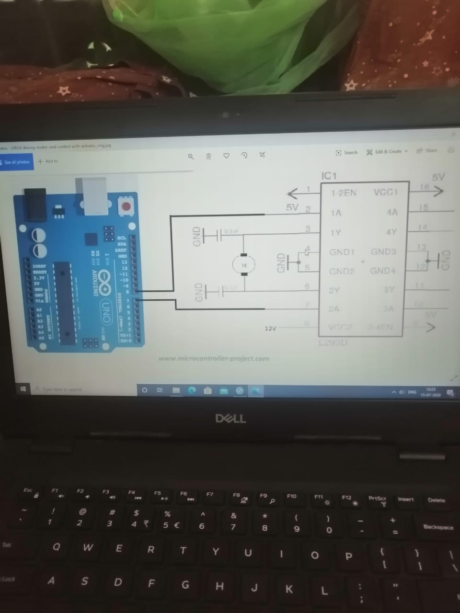

# Evidence register

All five photos were supplied during reconstruction on 2026-09-29. Filenames describe receipt, not the original project date. Diagrams may be workshop/reference material; they cannot establish final as-built wiring or successful operation.

| Image | Visible evidence | What remains uncertain |
| --- | --- | --- |
| [01](../assets/reference/01-motor-breadboard.jpeg) | Uno, breadboard, DIP driver, two DC motors | Exact connections and driver marking |
| [02](../assets/reference/02-rf-pin-diagram.jpeg) | Presentation with RF transmitter and receiver pin diagrams | Manufacturer, frequency, voltage, modulation |
| [03](../assets/reference/03-rf-receiver.jpeg) | Uno wired to an RF receiver-style module | Exact pin numbers and module variant |
| [04](../assets/reference/04-accelerometer.jpeg) | Analog accelerometer breakout, X/Y/Z labels, Uno analog header | Appears ADXL335-style; model needs confirmation |
| [05](../assets/reference/05-l293d-schematic.jpeg) | Explicit L293D label and single-motor schematic | Reference circuit, not proof of final two-motor wiring |

## Original reference photographs

## Owner-confirmed behavior

On 2026-09-29, the owner confirmed that hand tilts commanded forward, reverse, and turns. Exact gesture-to-axis mapping and neutral-stop behavior were not specified; those remain reconstruction choices.
