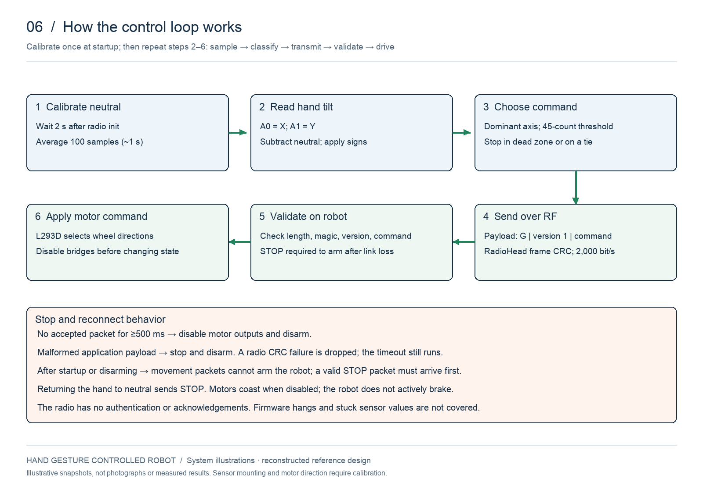
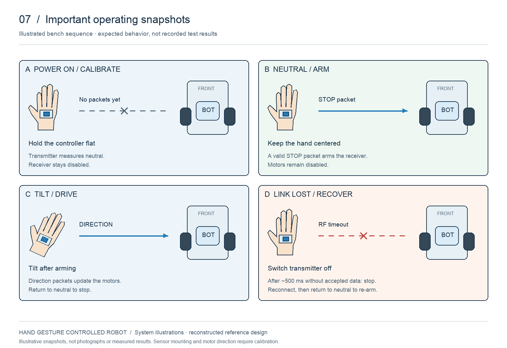

# How the hand-controlled robot works

The owner confirms forward movement, reverse movement, and turning by hand tilt. The following illustrations explain the repository’s reconstructed implementation. The physical mounting, chassis appearance, axis signs, radio variants, and original stop behavior have not been recovered.

## Complete setup

The proposed hand-mounted analog sensor supplies X/Y signals to the transmitter Uno. That Uno classifies tilt and sends a short command through an RF transmitter. A separate receiver Uno validates the received data and controls the L293D and two motors. The hand controller has its own power and ground; on the robot, logic and motor power share a common ground.

## Gesture snapshots

Forward and reverse drive both wheels in the same direction. Left and right use opposite wheel directions to pivot. The drawing views the robot from above with its front at the top. Sensor installation determines which physical tilt produces positive or negative X/Y, so calibrate the axis signs to match the intended gestures.

## Processing and communication

Startup calibration averages the neutral position. Subsequent readings are expressed as deviations from neutral. The largest absolute axis selects direction when outside the 45-count dead zone; equal absolute deviations select stop. These are raw ADC counts, not degrees.

The three-byte application payload contains `G`, version `1`, and command `0`–`4`. RadioHead handles radio framing and CRC. After transmission completes, the transmitter waits 50 ms; packet airtime makes the total interval longer than 50 ms. The radio rate is a configuration value, not a measured end-to-end latency.

## Important operating states

1. **Power on:** the transmitter calibrates while held still; a newly powered receiver keeps motor outputs disabled.
2. **Neutral:** a valid stop packet arms the receiver while leaving motors off.
3. **Tilt:** accepted direction commands operate the motors. Returning to neutral disables both bridges and lets the wheels coast.
4. **Link loss:** 500 ms without an accepted packet disarms the receiver. Restore the link and send neutral before movement is accepted again. Timing is checked by the firmware loop, not a guaranteed physical stopping time.

These panels are illustrative snapshots. Follow the [bench validation plan](validation.md) to capture real measurements or demonstration photos later. No assembled-bot photographs or test outcomes are fabricated.

## Circuit details and downloads

Use the [diagram index](diagrams.md) for all seven PNG/SVG pairs, and the [hardware guide](hardware.md) for wiring. Files 01–03 show the electrical connections; files 04–07 explain the system and operating behavior.
